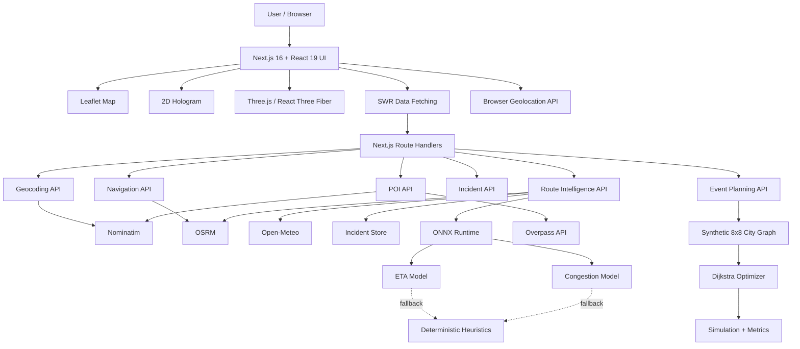

# RouteCast — Event Route Digital Twin & AI Traffic Simulator

> A full-stack route-intelligence platform for event logistics, point-to-point navigation, traffic simulation, weather-aware route scoring, incident analysis, and 2D/3D visualization.

[](https://nextjs.org/)
[](https://react.dev/)
[](https://www.typescriptlang.org/)
[](https://tailwindcss.com/)
[](https://leafletjs.com/)
[](https://www.openstreetmap.org/)
[](https://threejs.org/)
[](https://onnxruntime.ai/)

---

## Overview

**RouteCast** is a browser-based capstone/research prototype that extends ordinary navigation with route intelligence, scenario simulation, event-level route planning, weather and incident context, optional machine-learning inference, route progress tracking, and 2D/3D visualizations.

The application supports two major routing experiences:

- **Event Mode** — multiple invitees travel from different origins to a common venue using a deterministic synthetic city graph.
- **Directions Mode** — users select real-world origins, destinations, optional waypoints, and travel modes, then receive routes from OSRM using OpenStreetMap data.

Unlike a conventional mapping application that focuses mainly on shortest/fastest path selection, RouteCast compares routes using predicted ETA, congestion, incident effects, weather impact, risk, relative route performance, and scenario changes.

> **Project status:** Functional research/capstone prototype.  
> It contains real geocoding, routing, weather, POI lookup, interactive navigation behavior, simulation, and visualization, but it is **not** a production-grade live-traffic navigation platform.

---

## Purpose

RouteCast was built to demonstrate how route planning can evolve beyond simple shortest-path navigation by combining:

- geospatial routing,
- graph optimization,
- traffic and incident simulation,
- weather-aware scoring,
- route comparison,
- browser geolocation,
- optional AI/ML inference,
- smart-city style analytics,
- and interactive 2D/3D visualization.

### Potential use cases

The current implementation is suitable for exploratory or academic scenarios such as:

- event and venue access planning,
- conference/festival transportation planning,
- route-risk comparison,
- delivery-route comparison prototypes,
- emergency-response scenario demonstrations,
- road-closure impact analysis,
- smart-city demonstrations,
- urban mobility research,
- weather-aware route decision support.

It is **not** currently a certified emergency-routing, fleet-management, or production dispatch system.

---

## Key Features

| Feature | Status | Description |
|---|---|---|
| Interactive Leaflet map | Implemented | Pan, zoom, route layers, incidents, POIs, GPS position, route progress |
| OpenStreetMap integration | Implemented | OSM tiles/services used for mapping, geocoding, POIs, and routing |
| Forward geocoding | Implemented | Nominatim-based text search |
| Reverse geocoding | Implemented | Converts selected coordinates into readable places |
| Browser geolocation | Implemented | One-time location lookup and continuous watch |
| Event-mode routing | Implemented / simulated graph | Multi-invitee routes to one venue using a synthetic 8×8 city graph |
| Directions routing | Implemented | Real OSRM routing for point-to-point travel |
| Route alternatives | Implemented | Displays alternatives when the provider returns them |
| Driving / walking / cycling | Implemented | OSRM-backed; public-server profile limitations may trigger estimated timing fallback |
| Route visualization | Implemented | Active and alternative routes rendered on the map |
| Navigation session | Prototype | GPS tracking, progress, off-route detection, rerouting, follow-camera |
| Turn instructions | Implemented | Generated from OSRM maneuver metadata |
| Predicted congestion | Implemented | Deterministic heuristic or optional ONNX output |
| Incident intelligence | Implemented | Reported and simulated incidents matched spatially to routes |
| Weather intelligence | Implemented | Open-Meteo route-corridor enrichment |
| Nearby POIs | Implemented | Overpass API with Nominatim fallback |
| Route scoring | Implemented | 0–100 comparative route score |
| Route recommendation | Implemented | Highest-scoring route is recommended with explanation |
| Dijkstra optimization | Implemented | Used for the synthetic event graph |
| Scenario simulation | Implemented | Closure, accident, surge, weather/rain/flood scenarios |
| Metrics dashboard | Implemented / derived | Congestion, speed, AQI, emergency response, CO₂, fuel, incidents |
| Congestion forecast | Implemented | Six-step forecast with heuristic or optional ONNX prediction |
| Map layer controls | Implemented | Traffic, incidents, pollution, closures, basemap selection |
| 2D hologram | Implemented | Abstract normalized route/network visualization |
| 3D hologram | Implemented | Three.js / React Three Fiber abstract route scene |
| ONNX inference | Optional | ETA and congestion model support |
| ML training pipeline | Implemented | PyTorch synthetic-data training and ONNX export |
| Capstone presentation | Implemented | Browser presentation route and generated PowerPoint deck |
| Database | Not implemented | No persistent database |
| Authentication | Not implemented | No login or multi-user authorization |
| Persistent incident storage | Not implemented | Incidents are stored in process memory only |
| Live commercial traffic | Not implemented | Traffic is predicted/simulated rather than observed |

---

## How RouteCast Works

### Event Mode

1. The application generates a deterministic **8×8 synthetic city graph**.
2. A venue and multiple invitee origins are represented on that graph.
3. The user adjusts routing priorities such as:
   - time,
   - distance,
   - congestion.
4. RouteCast uses **Dijkstra's algorithm** to produce routes.
5. Users can apply scenarios such as:
   - road closure,
   - accident,
   - traffic surge,
   - severe weather.
6. The graph state and derived metrics change in response.
7. Results can be viewed in:
   - Map,
   - 2D Hologram,
   - 3D Hologram.

### Directions Mode

1. Search for an origin and destination or select coordinates on the map.
2. Nominatim converts text searches into geographic coordinates.
3. OSRM returns real route geometry, duration, distance, alternatives, and steps.
4. Routes are rendered through Leaflet.
5. The route-intelligence API enriches candidate routes with:
   - predicted traffic,
   - incidents,
   - weather,
   - ETA,
   - risk,
   - comparative score.
6. The user can start a navigation session.
7. RouteCast tracks progress and can reroute when off-route movement is detected.

---

## Architecture



---

## Technology Stack

| Technology | Version | Role |
|---|---:|---|
| Next.js | 16.3.0 | Full-stack framework, App Router, API routes |
| React | ^19 | UI rendering |
| React DOM | ^19 | Browser rendering |
| TypeScript | 5.7.3 | Type-safe application code |
| Tailwind CSS | 4.3.3 | Styling |
| PostCSS | ^8.5 | CSS processing |
| shadcn | ^4.8.0 | UI tooling |
| Base UI | ^1.5.0 | UI primitives |
| Lucide React | ^1.16.0 | Icons |
| Leaflet | ^1.9.4 | Interactive mapping |
| React Leaflet | ^5.0.0 | React bindings for Leaflet |
| Three.js | ^0.185.1 | 3D rendering |
| React Three Fiber | ^9.7.0 | React renderer for Three.js |
| React Three Drei | ^10.7.7 | 3D helpers and controls |
| SWR | ^2.5.0 | Client-side fetching and caching |
| ONNX Runtime Node | ^1.27.0 | Optional ML inference |
| Vercel Analytics | 1.6.1 | Production analytics |
| PptxGenJS | ^4.0.1 | PowerPoint deck generation |
| PyTorch | ML tooling | Optional model training |
| Python | 3.x | Optional ML training pipeline |
| pnpm | Recommended | Package management |

---

## External Services

### Nominatim

Used for:

- forward geocoding,
- reverse geocoding,
- nearby-place fallback.

Default:

```text
https://nominatim.openstreetmap.org
```

No API key is required for the current development configuration.

### OSRM

Used for:

- route geometry,
- route alternatives,
- route steps,
- distances,
- durations.

Default:

```text
https://router.project-osrm.org
```

No API key is required.

### Overpass API

Used for OpenStreetMap nearby-place discovery.

Default:

```text
https://overpass-api.de/api/interpreter
```

### Open-Meteo

Used for current weather enrichment along route corridors.

Default:

```text
https://api.open-meteo.com/v1/forecast
```

### Map Tiles

The project can use map layers from:

- OpenStreetMap,
- CARTO,
- Esri World Imagery.

> Public instances are convenient for development and demonstrations but are subject to provider terms, attribution rules, rate limits, and availability.

---

## Project Structure

```text
RouteCaste/
├── app/
│   ├── api/
│   │   ├── geocode/route.ts
│   │   ├── incidents/route.ts
│   │   ├── intelligence/route/route.ts
│   │   ├── navigation/route/route.ts
│   │   ├── places/nearby/route.ts
│   │   └── plan/route.ts
│   ├── presentation/
│   │   └── page.tsx
│   ├── globals.css
│   ├── layout.tsx
│   └── page.tsx
│
├── components/
│   ├── city-map.tsx
│   ├── comparison-table.tsx
│   ├── control-panel.tsx
│   ├── forecast-strip.tsx
│   ├── hologram-2d.tsx
│   ├── hologram-3d.tsx
│   ├── layer-controls.tsx
│   ├── location-search.tsx
│   ├── metrics-dashboard.tsx
│   ├── nav-hud.tsx
│   ├── navigation-panel.tsx
│   ├── poi-panel.tsx
│   ├── route-intel-panel.tsx
│   ├── scenario-panel.tsx
│   ├── whatif-panel.tsx
│   ├── presentation/
│   │   ├── slide-deck.tsx
│   │   └── slides.tsx
│   └── ui/
│       └── button.tsx
│
├── hooks/
│   ├── use-area-names.ts
│   ├── use-geolocation.ts
│   ├── use-nav-session.ts
│   ├── use-navigation-route.ts
│   └── use-route-intel.ts
│
├── lib/
│   ├── city.ts
│   ├── ml.ts
│   ├── optimizer.ts
│   ├── sim.ts
│   ├── store.ts
│   ├── types.ts
│   ├── utils.ts
│   ├── geo/
│   │   ├── geocoder.ts
│   │   ├── places.ts
│   │   └── routing.ts
│   ├── intel/
│   │   ├── incidents.ts
│   │   ├── score.ts
│   │   └── weather.ts
│   └── nav/
│       └── progress.ts
│
├── ml/
│   ├── README.md
│   ├── data.py
│   ├── requirements.txt
│   ├── schema.py
│   └── train.py
│
├── models/
│   └── README.md
│
├── public/
│   ├── RouteCast-Capstone-Deck.pptx
│   └── ...
│
├── scripts/
│   └── generate-deck.mjs
│
├── .env.example
├── .gitignore
├── next.config.mjs
├── package.json
├── pnpm-lock.yaml
├── postcss.config.mjs
└── tsconfig.json
```

---

## API Reference

### `GET /api/geocode`

Forward geocoding.

Example:

```text
/api/geocode?q=Vijayawada&limit=5
```

Returns matching places with:

- name,
- address,
- latitude,
- longitude,
- place type.

The same endpoint also supports reverse-geocoding parameters using latitude and longitude.

---

### `GET /api/plan`

Plans routes using the deterministic local city graph.

Important parameters include:

```text
mode=event|directions
wTime
wDistance
wCongestion
scenario=none|closure|accident|surge|weather
intensity
density
lat
lng
```

It can return:

- graph data,
- event/invitee routes,
- alternatives,
- metrics,
- baseline metrics,
- incidents,
- pollution zones,
- forecast values,
- model status,
- rerouting information.

---

### `POST /api/navigation/route`

Creates real point-to-point routes using OSRM.

Example body:

```json
{
  "origin": {
    "lat": 16.5062,
    "lon": 80.6480
  },
  "destination": {
    "lat": 16.3067,
    "lon": 80.4365
  },
  "waypoints": [],
  "mode": "driving",
  "alternatives": true
}
```

Returns:

- route engine,
- travel mode,
- route alternatives,
- distance,
- duration,
- geometry,
- navigation steps,
- estimated-duration indicators.

---

### `POST /api/intelligence/route`

Enriches routes with intelligence and scenario analysis.

Example:

```json
{
  "origin": {
    "lat": 16.5062,
    "lon": 80.6480
  },
  "destination": {
    "lat": 16.3067,
    "lon": 80.4365
  },
  "waypoints": [],
  "mode": "driving",
  "scenario": {
    "type": "closure",
    "intensity": 0.6,
    "at": {
      "lat": 16.42,
      "lon": 80.55
    }
  }
}
```

Supported scenario types:

```text
none
closure
accident
traffic
rain
flood
```

Response intelligence may include:

- route alternatives,
- baseline and scenario intelligence,
- weather,
- incidents,
- predicted traffic,
- ETA,
- route score,
- recommendation,
- model availability,
- detour information.

---

### `GET /api/incidents`

Returns current in-memory incidents.

Optional filters:

```text
lat
lon
radius
```

---

### `POST /api/incidents`

Creates an incident.

Example:

```json
{
  "type": "accident",
  "lat": 16.45,
  "lon": 80.60,
  "severity": "high",
  "radiusMeters": 500,
  "description": "Lane blocked"
}
```

Supported incident types:

- accident,
- closure,
- construction,
- flooding,
- obstruction,
- emergency,
- weather.

> Incident data is process-local and is lost when the server restarts.

---

### `DELETE /api/incidents`

Examples:

```text
/api/incidents?id=<incident-id>
```

or

```text
/api/incidents?simulated=1
```

---

### `GET /api/places/nearby`

Returns nearby OpenStreetMap POIs.

Typical parameters:

```text
category
lat
lon
radius
limit
```

Primary provider: Overpass API  
Fallback provider: Nominatim

Supported categories include:

- restaurants,
- hotels,
- hospitals,
- universities,
- airports,
- fuel stations,
- EV charging,
- banks,
- ATMs,
- pharmacies,
- police,
- fire stations,
- parking,
- shopping,
- attractions,
- government facilities.

---

## Route Intelligence

RouteCast uses comparative route scoring rather than treating the routing engine's first result as automatically optimal.

### Congestion

Baseline congestion is estimated using time-of-day behavior and may be adjusted using:

- weekday/weekend patterns,
- incidents,
- traffic-surge scenarios,
- weather,
- optional ONNX congestion prediction.

Incident severity weights:

```text
low      = 0.20
medium   = 0.45
high     = 0.70
critical = 1.00
```

Closures, flooding, and critical incidents may mark routes as blocked.

### ETA

Heuristic ETA is based on:

```text
base ETA
× (1 + traffic × 0.85)
× (1 + weather impact × 0.22)
+ incident delay
```

### Risk

Risk combines:

```text
incident risk × 0.45
+ weather impact × 0.30
+ traffic level × 0.15
+ area density × 0.10
+ blockage penalty
```

### Comparative Score

RouteCast produces a normalized 0–100 route score based on relative candidate-route performance:

```text
1
- time penalty × 0.45
- risk score × 0.30
- traffic level × 0.18
- weather impact × 0.07
```

Blocked routes are heavily penalized.

The highest-scoring route becomes the recommendation.

> Traffic and ETA values are predicted or simulated unless a real external provider/model explicitly supplies them.

---

## Machine Learning

Machine learning is **optional**.

The application supports two ONNX models:

```text
models/eta.onnx
models/congestion.onnx
```

If these model files are missing or inference fails, RouteCast automatically falls back to deterministic heuristics.

### ETA Model

Expected input includes nine normalized features such as:

- distance,
- average congestion,
- number of segments,
- hour sine/cosine,
- weekend indicator,
- area density,
- scenario severity,
- rain.

### Congestion Model

Expected features include:

- current congestion,
- forecast step,
- hour sine/cosine,
- incident load,
- weekend indicator,
- area density,
- scenario severity,
- rain.

### Tensor contract

```text
Input name:  input
Input type:  float32
Input shape: [batch, N]

Output name: output
Output shape: [batch, 1]
```

### Training Pipeline

The `ml/` directory contains a PyTorch-based training workflow.

By default it can train feed-forward MLP regressors using synthetic data and export ONNX models.

Training generates:

```text
models/eta.onnx
models/congestion.onnx
models/metrics.json
```

The current project should be described as **ML-ready**, not as a production-trained traffic prediction system, because the training data is synthetic and production model artifacts are not bundled.

---

## Scenario Simulation

### Event Mode

Supported scenarios:

- closure,
- accident,
- traffic surge,
- weather.

The local graph is cloned before mutation so the cached baseline graph is not permanently modified.

### Real-Route Intelligence

Supported scenarios:

- road closure,
- accident,
- traffic surge,
- heavy rain,
- flood.

For blockage scenarios, RouteCast can request genuine OSRM detours using offset waypoints.

The detour geometry is therefore generated by the real routing engine, while the incident/blockage itself remains simulated.

---

## 2D and 3D Visualization

### 2D Hologram

The 2D mode renders a normalized representation of:

- synthetic graph,
- routes,
- venue,
- invitees,
- traffic conditions.

It is an explanatory visualization rather than a geographic map.

### 3D Hologram

Built with:

- Three.js,
- React Three Fiber,
- React Three Drei.

It visualizes:

- normalized route geometry,
- grid,
- elevated routes,
- venue markers,
- origins,
- POIs,
- incident effects.

> The 3D view is an abstract route/network visualization. It is **not** a full 3D city digital twin with real buildings, terrain, and city meshes.

---

## Environment Variables

Create `.env.local` from `.env.example`.

| Variable | Required | Default / Example | Purpose |
|---|---|---|---|
| `GEOCODING_URL` | Optional | `https://nominatim.openstreetmap.org` | Geocoder endpoint |
| `GEO_USER_AGENT` | Recommended | `RouteCast/1.0 (capstone digital twin)` | Nominatim identification |
| `ROUTING_URL` | Optional | `https://router.project-osrm.org` | Routing engine |
| `ETA_MODEL_PATH` | Optional | `models/eta.onnx` | ETA ONNX model |
| `CONGESTION_MODEL_PATH` | Optional | `models/congestion.onnx` | Congestion ONNX model |
| `OVERPASS_URL` | Optional | `https://overpass-api.de/api/interpreter` | POI provider |
| `WEATHER_API_URL` | Optional | `https://api.open-meteo.com/v1/forecast` | Weather provider |

Windows CMD:

```cmd
copy .env.example .env.local
```

PowerShell:

```powershell
Copy-Item .env.example .env.local
```

Linux/macOS:

```bash
cp .env.example .env.local
```

---

## Installation

### Prerequisites

Recommended:

- Node.js 20+
- pnpm
- modern browser
- internet connection
- browser geolocation permission for GPS features

Optional:

- Python 3.x for model training
- native runtime compatibility for `onnxruntime-node`

### Clone the Repository

```bash
git clone https://github.com/Dark-Matter007/RouteCaste.git
cd RouteCaste
```

### Install Dependencies

Recommended:

```bash
pnpm install
```

Or with npm:

```bash
npm install
```

### Configure Environment

```cmd
copy .env.example .env.local
```

### Run Development Server

```bash
pnpm dev
```

or:

```bash
npm run dev
```

Then open the local URL printed by Next.js, normally:

```text
http://localhost:3000
```

---

## Available Commands

Using pnpm:

```bash
pnpm dev
pnpm build
pnpm start
pnpm lint
```

Using npm:

```bash
npm run dev
npm run build
npm run start
npm run lint
```

There is currently no dedicated automated test script in `package.json`.

---

## Optional ML Training

Windows PowerShell example:

```powershell
cd ml
python -m venv .venv
.venv\Scripts\Activate.ps1
pip install -r requirements.txt
python train.py
```

The training pipeline is expected to create model artifacts under:

```text
models/
```

The Next.js backend searches for the default files:

```text
models/eta.onnx
models/congestion.onnx
```

or paths supplied through environment variables.

---

## How to Use

### Find a Location

Use the location search box and choose a Nominatim result.

RouteCast can use that coordinate to:

- center the map,
- relocate the event-mode synthetic graph,
- define route points,
- search nearby POIs.

### Create Real Directions

1. Switch to **Directions Mode**.
2. Select an origin.
3. Select a destination.
4. Choose:
   - driving,
   - walking,
   - cycling.
5. Add optional waypoints.
6. Generate routes.
7. Select an alternative.
8. Inspect route steps and intelligence.

### Compare Routes

Route intelligence can compare:

- predicted ETA,
- traffic level,
- weather impact,
- incidents,
- risk,
- AI/comparative score.

### Start Navigation

1. Choose a route.
2. Start navigation.
3. Grant browser location permission.
4. RouteCast tracks your position and route progress.
5. Off-route movement can trigger rerouting.

Manual map interaction can also be used for demonstrations when GPS is unavailable.

### Run a Scenario

Apply a scenario such as:

- closure,
- accident,
- traffic surge,
- heavy rain,
- flood.

Then compare:

- baseline route,
- scenario route,
- congestion,
- predicted ETA,
- incidents,
- derived city metrics.

### Explore Nearby POIs

Choose categories such as:

- hospital,
- police,
- fuel,
- EV charging,
- parking,
- restaurant,
- hotel.

POIs can be inspected and used as route stops or destinations.

### Switch Visualization Mode

Use:

- Map,
- 2D Holo,
- 3D Holo.

---

## Advantages

- Uses an open geospatial stack.
- Default setup requires no commercial mapping API key.
- Supports real-world routing and geocoding.
- Combines navigation with route intelligence.
- Includes event-level multi-traveler planning.
- Includes incident and weather-aware analysis.
- Supports configurable routing priorities.
- Provides deterministic simulation for repeatable demonstrations.
- Supports optional ONNX inference.
- Continues to work using heuristic fallback when ML models are unavailable.
- Includes map, 2D, 3D, and presentation views.
- Can be self-hosted as a Next.js application.
- Provides a strong full-stack/geospatial/AI capstone demonstration.

---

## Current Limitations

- No live commercial traffic feed.
- Event-mode road network is synthetic.
- Many metrics and forecasts are heuristic/derived by default.
- ML training data is synthetic.
- ONNX model artifacts are optional and not bundled.
- Incidents are stored only in process memory.
- No database or PostGIS integration.
- No authentication or user accounts.
- No persistent analytics/history.
- Public Nominatim, OSRM, Overpass, and tile providers may rate-limit requests.
- Browser geolocation requires user permission.
- Public OSRM walking/cycling support may be limited.
- The 3D view is abstract, not a full 3D city representation.
- No automated test suite is currently configured.
- No application-level rate limiting is currently implemented.
- Native `onnxruntime-node` deployment may require environment-specific handling.

---

## Security & Privacy Considerations

Current positive design choices:

- configuration is managed through environment variables,
- `.env.example` contains configuration examples rather than secrets,
- geocoding/routing requests are proxied through application API routes,
- browser geolocation depends on user permission.

Before production use, the project should add:

- authentication,
- authorization,
- incident API protection,
- request schema validation,
- rate limiting,
- persistent audit logs,
- secure headers,
- provider quota monitoring,
- location-data privacy policies,
- durable secure storage.

---

## Performance & Scalability

The current event graph contains only 64 nodes, so the local Dijkstra implementation is intentionally simple and appropriate for a capstone-sized simulation.

Potential bottlenecks include:

- public API latency,
- Overpass query performance,
- repeated weather/routing requests,
- large Leaflet overlay counts,
- Three.js rendering on low-end devices,
- process-local state across multiple server instances.

For larger-scale production use, consider:

- Redis/server-side response caching,
- PostgreSQL + PostGIS,
- A* or bidirectional Dijkstra,
- self-hosted OSRM/Nominatim/Overpass,
- shared incident storage,
- WebSocket or SSE updates,
- dedicated ML model serving,
- observability and provider monitoring.

---

## Deployment

### Vercel

The standard Next.js UI and API routes are compatible with Vercel.

Potential concerns:

- `onnxruntime-node` native runtime compatibility,
- model-file packaging,
- filesystem paths,
- public provider rate limits,
- process-local incident state,
- serverless execution limits.

### Traditional Node.js Server

A Node.js server is a strong fit for the current architecture because it supports:

- Next.js server execution,
- persistent ONNX sessions during process lifetime,
- native Node dependencies,
- predictable filesystem model paths.

### Docker

The project can be containerized using:

- Node.js base image,
- pnpm install,
- `next build`,
- `next start`,
- optional model files,
- environment-based provider configuration.

Python model training is better treated as a separate training workflow/container.

---

## Presentation System

RouteCast includes a capstone presentation system.

Browser presentation:

```text
/presentation
```

Relevant files:

```text
app/presentation/page.tsx
components/presentation/slide-deck.tsx
components/presentation/slides.tsx
```

PowerPoint generation:

```text
scripts/generate-deck.mjs
```

Generated deck:

```text
public/RouteCast-Capstone-Deck.pptx
```

The presentation covers project overview, problem statement, architecture, ML, simulation, visualization, and technology stack.

---

## Recommended Future Work

### Short Term

- Add automated unit and API tests.
- Enable strict TypeScript build validation.
- Add request validation.
- Add rate limiting.
- Add persistent incident storage.
- Improve provider loading/error states.
- Add route-intelligence export.
- Add map legends and clearer data provenance.

### Medium Term

- Integrate a live traffic provider.
- Add real incident/event feeds.
- Add authentication and user workspaces.
- Add WebSocket/SSE real-time updates.
- Store historical routes and simulations.
- Train ML models with real traffic data.
- Add model versioning and drift monitoring.
- Self-host OSRM, Nominatim, and Overpass.
- Add multi-modal transit routing.
- Add fleet/delivery optimization.

### Long Term

- Add PostgreSQL/PostGIS city data.
- Build richer 3D city/terrain visualization.
- Add voice navigation.
- Create mobile applications.
- Support emergency-priority routing.
- Add city-scale graph partitioning.
- Add IoT/sensor integration.
- Add predictive mobility-demand forecasting.
- Add privacy-preserving location analytics.

---

## Skills Demonstrated

RouteCast demonstrates experience with:

- full-stack Next.js development,
- React architecture,
- TypeScript,
- REST API design,
- browser APIs,
- OpenStreetMap ecosystem,
- geocoding,
- routing,
- route geometry,
- graph algorithms,
- Dijkstra optimization,
- geospatial distance calculations,
- spatial incident matching,
- scenario simulation,
- route scoring,
- SWR data fetching,
- Leaflet,
- Three.js,
- React Three Fiber,
- ONNX Runtime,
- PyTorch,
- synthetic ML training data,
- responsive dashboard design,
- technical presentation generation.

---

## Screenshots Recommended for This README

For a stronger GitHub presentation, add screenshots of:

1. Main RouteCast map/dashboard
2. Directions mode with route alternatives
3. Route intelligence panel
4. Closure/accident scenario simulation
5. Metrics dashboard and congestion forecast
6. 2D hologram
7. 3D hologram
8. Presentation page

Suggested folder:

```text
public/readme/
```

Then embed them in this README, for example:

```markdown

```

---

## GitHub Topics

Recommended repository topics:

```text
nextjs
react
typescript
tailwindcss
leaflet
openstreetmap
nominatim
osrm
overpass-api
geospatial
geospatial-analysis
route-optimization
route-intelligence
traffic-simulation
digital-twin
smart-city
machine-learning
onnx
pytorch
threejs
react-three-fiber
navigation
weather-api
```

---

## Project Status

**Functional research/capstone prototype**

RouteCast is more than a static UI demo because it includes:

- working Next.js APIs,
- real geocoding,
- real route generation,
- real weather enrichment,
- real nearby-place lookup,
- navigation-session logic,
- rerouting,
- scenario simulation,
- optional ONNX inference,
- interactive 2D/3D visualization.

It should not yet be described as production-ready because it does not currently include:

- authentication,
- durable persistence,
- live traffic,
- production-trained ML models,
- rate limiting,
- automated testing,
- shared multi-instance state,
- full production observability.

---

## Repository

```text
https://github.com/Dark-Matter007/RouteCaste
```

---

## Disclaimer

RouteCast combines real external geospatial services with simulated and predicted intelligence.

Real services include routing, geocoding, weather, map tiles, and POI discovery. Event-mode traffic, some city metrics, scenarios, and default predictive outputs are deterministic or heuristic unless an optional ONNX model is available.

The application is intended for education, research, capstone demonstration, and prototyping. It should not be relied upon as a certified navigation, emergency-response, traffic-control, or safety-critical system.
